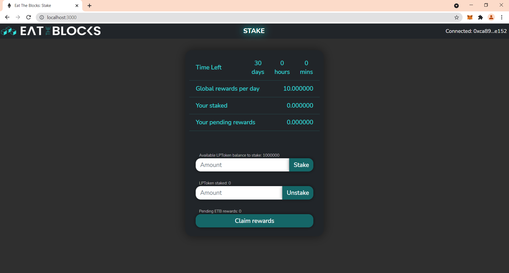

# Eat The Stake
Staking DApp for [Eat The Blocks Projects #2](https://github.com/jklepatch/eattheblocks/tree/master/etb-projects/project2-staking).



## Install
1. Install truffle/contract dependencies:
```
yarn install
```
2. Install client:
```
cd client
yarn install
```

## Unit tests
```
truffle test
```

## Run
1. Run ganache:
```
ganache-cli
```
1.1. Ganache Windows version.
Change truffle-config.json
```json
    ganache: {
      network_id: "5777",
      host: "127.0.0.1",
      port: 8545
    }
``` 
```
truffle migrate --reset --network ganache
```
2. Deploy contracts:
```
truffle migrate --reset
```
3. Start front end:
```
cd client
yarn start
```
4. If you'd like to pass 15 days in your Ganache blockchain, execute the following 2 lines at truffle console:
```
timestamp = (await web3.eth.getBlock(await await web3.eth.getBlockNumber()))['timestamp']
advancetime = new Promise((resolve,reject) => { web3.currentProvider.send({jsonrpc:'2.0', method: 'evm_mine', params: [timestamp+60*60*24*15], id: timestamp}, (err, result) => { if (err) { return reject(err) } return resolve(result); }) })
```
Change the time back
```
advancetime = new Promise((resolve,reject) => { web3.currentProvider.send({jsonrpc:'2.0', method: 'evm_mine', params: [timestamp+60*60*24*40], id: timestamp}, (err, result) => { if (err) { return reject(err) } return resolve(result); }) })
```
## Known issues/limitations
- The DApp was designed for ETB token and Pancakeswap LP tokens. So it only supports 18 decimal tokens, and no support for tokens with fee on transfer and other esoterica.
- For some reason, when running the unit tests, truffle takes around 1:30 minutes before it even reaches the initial compilation stage. I'm not sure if it's a local error or something with Truffle. Anyway, this does not happen when running deployment.
- In the truffle tests it is tricky to test for balances, as we are calculating based on seconds and sometimes there is 1-3 seconds of delay. [See here Gotacha#2](https://medium.com/fluidity/standing-the-time-of-test-b906fcc374a9) for explanation. To combat this, when testing time sensitive functions, I allow the actual result to be within 3 (monetary unit allocated per second) error of margin from the expected result.

## Misc
- The contract is based upon SushiSwap's MasterChef.
- In the development network, the contract deploys 2 mock ERC20 contracts and mints tokens for the first Ganache accounts, for testing. The first account will be the owner who is allowed to add rewards, and the next 2 accounts can be used for staking and testing. These contracts (ERC20Factory and MockERC20) will not be deployed to networks other than local dev networks.
## Pools
1. MDZA-xDAI Pair
https://info.honeyswap.org/#/pair/0xaa32bb2aded2a2c1a0213bd5aaa84332ae59344e
2. HNY-MDZA Pair
https://info.honeyswap.org/#/pair/0x5140dcfab6933cca971c2d1edbf4175e97d5b120
3. 1INCH-MDZA Pair
https://info.honeyswap.org/#/pair/0x4d9f71f0b50927b7ba1d528de690a15ac0f37265
4. MDZA-WXDAI
https://analytics-xdai.sushi.com/pairs/0xcd4f0d66262dafa6e786a132121e84aae4ffdf24
## Audit
Doc: https://mythx-cli.readthedocs.io/en/latest/

```shell
mkdir audit ; cd audit ; pip3 install mythx-cli
```
export MYTHX_API_KEY='xxxxxxxxxxxxx'

## Testnets
deposittoken adress on sokol testnet `0xa8366f25f4030013Dd364930dF6e9260Ac880c40`
## ToDo
### Fronted
- Instead of enter amount manual add "click to max".
- Info about previous phase and rewards.
### Backend
- Upgradable smart contracts
- Array of LPT (depositToken) tokens
- Audit
### Logic
- additional reward by amount of staked LPT . e.g +5% 
formula: 100 LPT +5% = 105 LPT + global daily award.
global daily award = 10
100 LPT + 5% + (10 * 15 day )= 255 MDZA